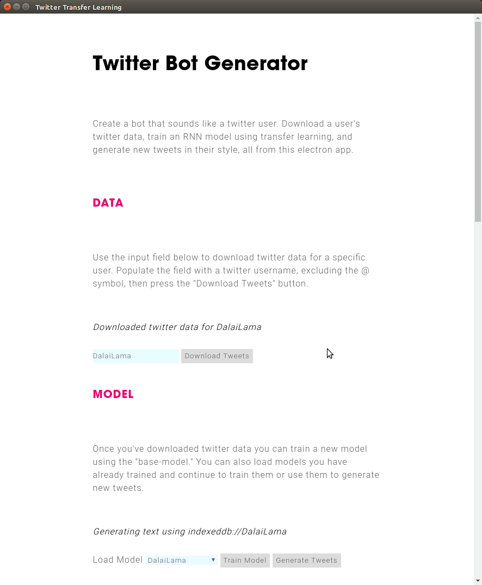
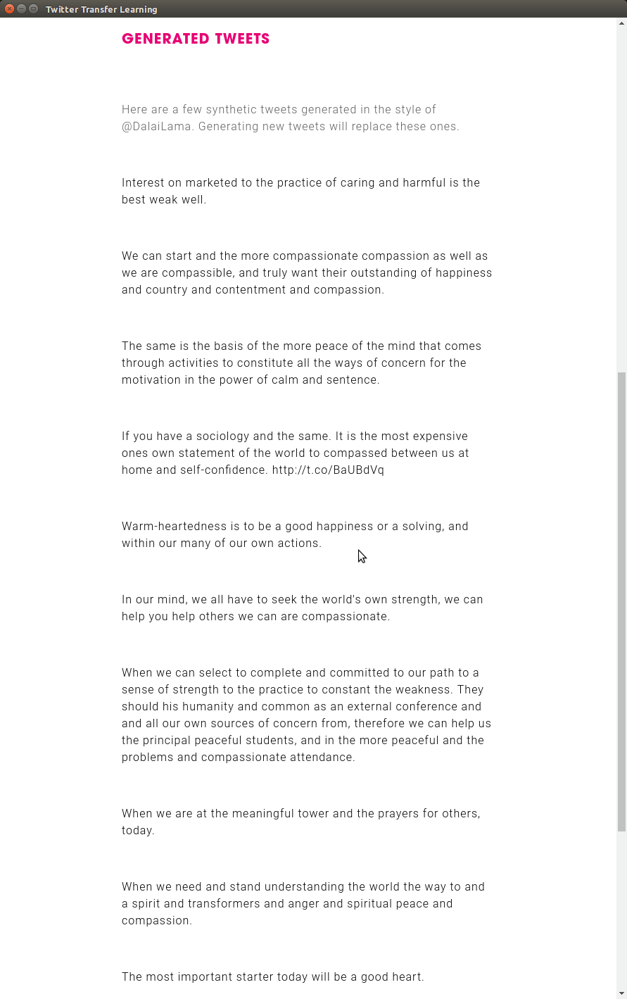

# Twitter Transfer Learning

Create twitter bots in-browser using Tensorflow.js and transfer learning with a pre-trained Keras RNN model from [`brangerbriz/char-rnn-text-generation`](https://brangerbriz/char-rnn-text-generation).

## Download & Install

```bash
# clone the project, including submodules
git clone --recursive https://github.com/brangerbriz/twitter-transfer-learning
cd twitter-transfer-learning

# install dependencies
npm install
```

## Install Tweet-Server

This project relies on [`brangerbriz/tweet-server`](https://github.com/brangerbriz/tweet-server). To run it, you must have an instance of `tweet-server` running on localhost port 3000, which will facilitate the downloading of twitter data for this application.

```bash
# clone the repo
git clone https://github.com/brangerbriz/tweet-server
cd tweet-server

# install the dependencies
npm install

# rename the example env file
cp .env-example .env

# ... edit .env using your own twitter API credentials

# start the server
npm start
```

## Run

```bash
cd twitter-transfer-learning
npm start
```

This will launch an electron application that you can use to:

1) Download twitter data for a user
2) Train a model using that user's twitter data, leveraging a pre-trained keras "base-model" that's been trained on > 9,000,000 tweets.
3) Generate new tweets with your trained model.

**WARNING**: Model training and tweet generation can a while depending on your computer's resources.



